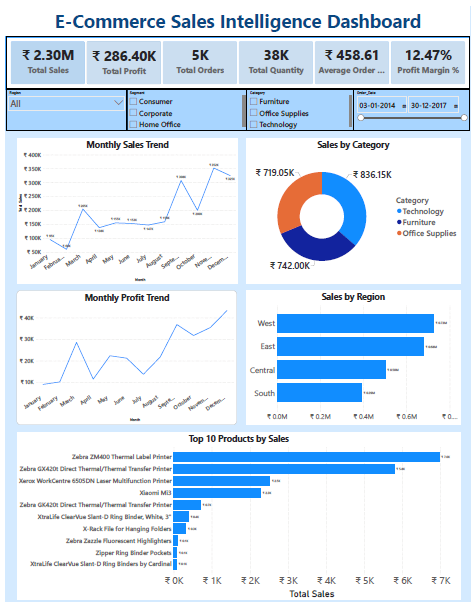
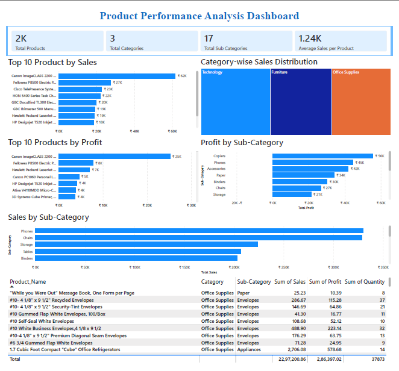
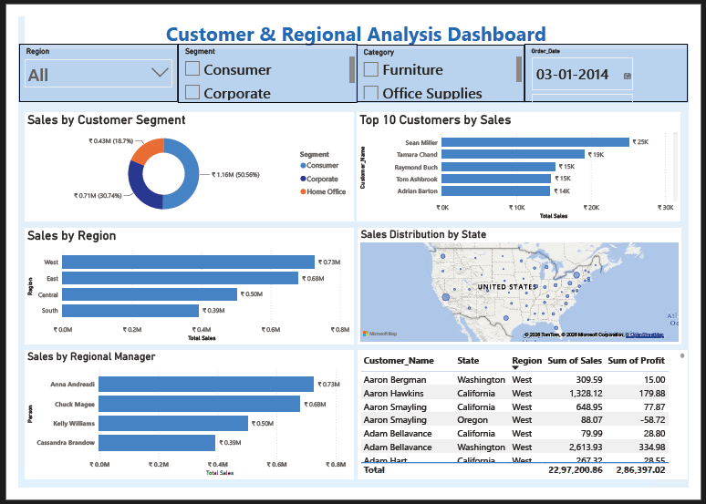
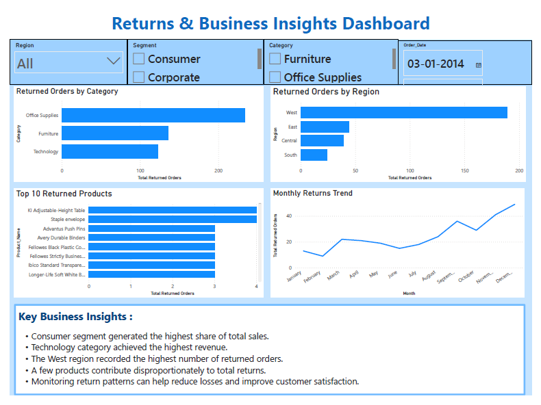

# 📊 E-Commerce Sales Intelligence Dashboard

> A Power BI data analytics project developed during my Data Analytics internship at **9Yards Creations**.


---

## 📌 Project Overview

The **E-Commerce Sales Intelligence Dashboard** is an interactive business intelligence project developed using **Microsoft Power BI** during my Data Analytics internship at **9Yards Creations**.

The objective of this project was to transform raw e-commerce transaction data into an interactive dashboard that helps analyze:

- Sales performance
- Profitability
- Product performance
- Customer behavior
- Regional sales
- Sales representatives
- Returned orders
- Monthly business trends

The dashboard converts raw data into meaningful visual insights that can support data-driven business decision-making.

---

## 🏢 Internship Information

| Detail | Information |
|---|---|
| **Organization** | 9Yards Creations |
| **Internship Domain** | Data Analytics |
| **Project Title** | E-Commerce Sales Intelligence Dashboard |
| **Duration** | June 2026 – July 2026 |
| **Primary Tool** | Microsoft Power BI |
| **Data Preparation** | Power Query |
| **Analysis & Calculations** | DAX |
| **Project Type** | Business Intelligence / Data Analytics |

---

# 🎯 Project Objectives

The major objectives of this project were:

1. Clean and prepare e-commerce data for analysis.
2. Develop meaningful business KPIs.
3. Analyze sales and profit trends over time.
4. Identify high-performing products and categories.
5. Analyze customer and regional sales performance.
6. Understand returned-order patterns.
7. Build an interactive Power BI report for business analysis.
8. Present data-driven insights through clear visualizations.

---

# 🛠️ Tools & Technologies

### Microsoft Power BI
Used to build the interactive dashboards, KPIs, charts, filters, maps, and tables.

### Power Query
Used for data preparation, transformation, formatting, and cleaning.

### DAX
Used to create analytical measures and calculate important business KPIs.

### Data Visualization
Used charts, KPI cards, maps, tables, and interactive slicers to communicate insights effectively.

---

# 📊 Dashboard Preview

## 1. Executive Dashboard



The Executive Dashboard provides a high-level overview of the business through key performance indicators and visual analysis.

### Key KPIs

- Total Sales
- Total Profit
- Total Orders
- Total Quantity
- Average Order Value
- Profit Margin %

### Analysis

- Monthly Sales Trend
- Monthly Profit Trend
- Sales by Category
- Sales by Region
- Top 10 Products by Sales

---

## 2. Product Performance Dashboard



The Product Performance Dashboard focuses on product-level and category-level performance.

### Key KPIs

- Total Products
- Total Categories
- Total Sub-Categories
- Average Sales per Product

### Analysis

- Top 10 Products by Sales
- Top 10 Products by Profit
- Category-wise Sales Distribution
- Profit by Sub-Category
- Sales by Sub-Category
- Detailed Product Performance Table

---

## 3. Customer & Regional Analysis Dashboard



This dashboard analyzes customer, geographic, segment, and sales representative performance.

### Analysis

- Sales by Customer Segment
- Top 10 Customers by Sales
- Sales by Region
- Sales Distribution by State
- Sales by Regional Manager
- Customer-level Sales and Profit

---

## 4. Returns & Business Insights Dashboard



This dashboard focuses on returned orders and identifies patterns that may require business attention.

### Analysis

- Returned Orders by Category
- Returned Orders by Region
- Top 10 Returned Products
- Monthly Returns Trend
- Key Business Insights

---

# 📈 Key Business Insights

Based on the dashboard analysis:

- The **Consumer segment** generated the highest share of total sales.
- **Technology** achieved the highest revenue among the analyzed categories.
- The **West region** recorded the highest number of returned orders.
- A small number of products contributed disproportionately to total returns.
- Monitoring return patterns can help identify potential areas for reducing losses and improving customer satisfaction.

> These insights are based on the data represented in the Power BI report and may change when different filters are applied.

---

# 📂 Data Model

The Power BI report contains three primary tables:

| Table | Purpose |
|---|---|
| **Orders** | Main transactional data used for sales, profit, products, customers, dates, categories, regions, and other analysis |
| **People** | Information used for sales representative / regional manager analysis |
| **Returns** | Data used for returned-order analysis |

### Main Analytical Areas

The data model supports:

- Sales analysis
- Profit analysis
- Product analysis
- Customer analysis
- Regional analysis
- Returns analysis
- Time-based analysis

---

# 📌 Key Metrics

The dashboard uses several business metrics to evaluate performance.

| Metric | Purpose |
|---|---|
| **Total Sales** | Measures overall revenue generated |
| **Total Profit** | Measures overall profit |
| **Total Orders** | Measures number of orders |
| **Total Quantity** | Measures total units sold |
| **Average Order Value** | Measures average revenue per order |
| **Profit Margin %** | Measures profitability relative to sales |
| **Total Products** | Measures number of products |
| **Total Categories** | Measures number of product categories |
| **Total Sub-Categories** | Measures number of sub-categories |
| **Returned Orders** | Measures the number of returned orders |

---

# 🔍 Data Analysis Workflow

The project followed a basic data analytics workflow:

```text
Raw Data
   ↓
Data Cleaning & Transformation
   ↓
Data Modeling
   ↓
DAX Measures & KPIs
   ↓
Exploratory Data Analysis
   ↓
Dashboard Development
   ↓
Business Insights
